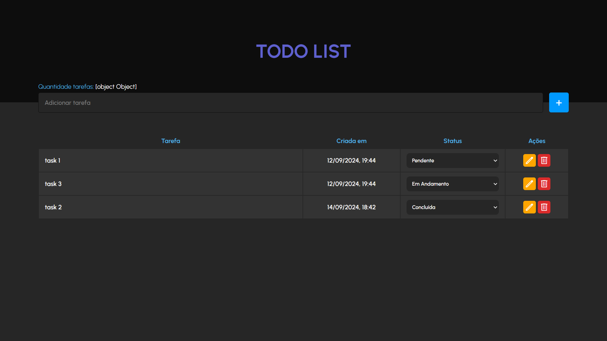

[JAVASCRIPT__BADGE]: https://img.shields.io/badge/Javascript-000?style=for-the-badge&logo=javascript

<h1 align="center" style="font-weight: bold;">Project ToDoList 💻</h1>

![javascript][JAVASCRIPT__BADGE]


<p align="center">
 <a href="#about">About</a> • 
 <a href="#started">Getting Started</a> • 
  <a href="#started">App Routes</a> • 
  <a href="#colab">Collaborators</a> •
 <a href="#contribute">Contribute</a>
</p>


<p align="center">
    
</p>

<h2 id="started">📌 About</h2>

ToDoList is a project developed to apply frontend and backend concepts. It allows users to create, view, edit,
and delete tasks in a to-do list. The frontend uses HTML, CSS, and JS to provide a simple and interactive interface,
while the backend, built with Express, manages the task data using MongoDB. The goal is to practice integrating these technologies 
and create a functional application for managing daily tasks

[Acess this site here!](https://project-to-do-list-fawn.vercel.app/)


<h2 id="started">🚀 Getting started</h2>

<h3>Prerequisites</h3>

<ul>
  <li><a href="https://nodejs.org/">Node.js</a> (LTS version recommended)</li>
  <li><a href="https://git-scm.com/">Git</a> (version 2.0 or higher)</li>
  <li><a href="https://www.prisma.io/">Prisma ORM</a> (for database management)</li>
  <li><a href="https://code.visualstudio.com/">Visual Studio Code (VS Code)</a> (recommended IDE)</li>
</ul>


<h3>Cloning</h3>

```bash
git clone https://github.com/Carlosxc-dev/project_toDoList.git
```


<h3> Environment Variables</h2>

Use the `process.env.SERVER_PORT` as reference to create your configuration file `.env` with your environment variables

```yaml
DATABASE_URL="{bancoDados}://{user}:{password}@localhost:{port}/{nameDatabase}?schema=public"
SERVER_PORT = {port}
```

<h3>Starting</h3>

In one terminal tab, execute:

```bash
cd project_toDoList/backend
npm install .
npm run prisma generate
npm run start
```

In the project folder: 

```bash
cd project_toDoList/frontend
abrir no navegador o arquivo index.html para ver a pagina
```

<h2 id="routes">📍 Application Routes</h2>
​
<table>
  <tr>
    <th>Route</th>
    <th>Description</th>
  </tr>
  <tr>
    <td><kbd>/tasks</kbd></td>
    <td>Retrieves all tasks from the database.</td>
  </tr>
  <tr>
    <td><kbd>/tasks</kbd></td>
    <td>Creates a new task.</td>
  </tr>
  <tr>
    <td><kbd>/tasks/:id</kbd></td>
    <td>Deletes a specific task by ID.</td>
  </tr>
  <tr>
    <td><kbd>/tasks/:id</kbd></td>
    <td>Updates a specific task by ID.</td>
  </tr>
  <tr>
    <td><kbd>/tasks/number</kbd></td>
    <td>Retrieves the total number of tasks.</td>
  </tr>
</table>


<h2 id="colab">🤝 Collaborators</h2>

<table>
  <tr>
    <td align="center">
      <a href="#">
        <br>
        <sub>
          <b>Carlos Henrique</b>
        </sub>
      </a>
    </td>
  </tr>
</table>

<h2 id="contribute">📫 Contribute</h2>

1. `git clone https://github.com/Carlosxc-dev/project_toDoList.git`
2. `git checkout -b feature/NAME`
3. Follow commit patterns
4. Open a Pull Request explaining the problem solved or feature made, if exists, append screenshot of visual modifications and wait for the review!

<h3>Documentations that might help</h3>

[📝 How to create a Pull Request](https://www.atlassian.com/br/git/tutorials/making-a-pull-request)

[💾 Commit pattern](https://gist.github.com/joshbuchea/6f47e86d2510bce28f8e7f42ae84c716)
